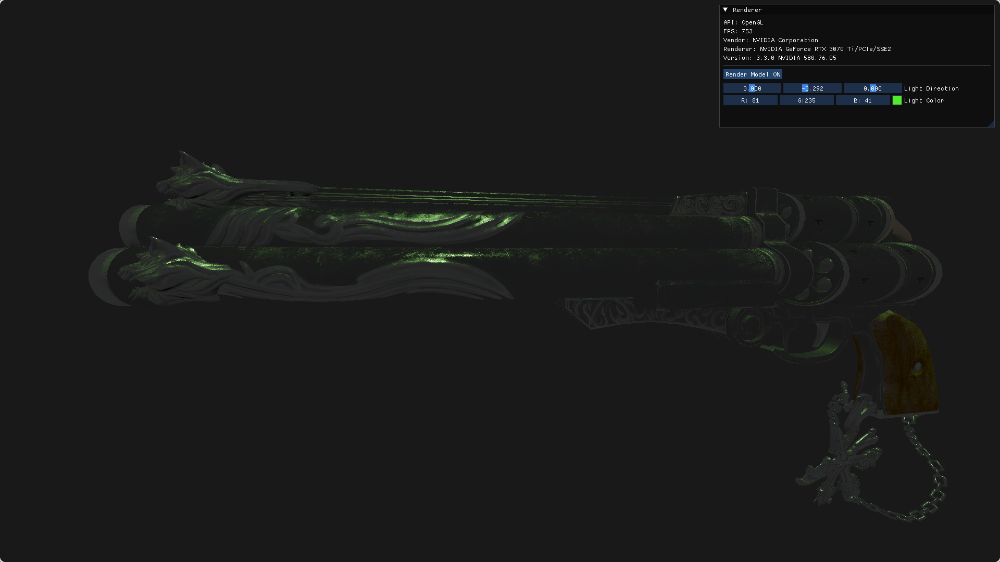

# Svarn

A simple rendering engine with the purpose to experiment with different computer graphics concepts. While only supporting OpenGL at the moment, the engine is built to add Vulkan or DirectX12 support at any time. 
The project initially started as a game engine project with the support of The Cherno's Game Engine series, but quickly diverged towards a more graphics focused engine. 
It is built with modularization in mind, to allow the user to quickly implement various computer graphics concepts and focus on the details of the algorithms, without having to work with the graphics API on its own.

## Requirements
- Jinja2
- works on both Linux and Window, but development is being done on Linux, thus the Linux build is more stable

## Dependencies
- CMake
- GLM

## How to build
### Linux:
A `GenerateLinuxBuild.sh` is provided. Executing it will generate the executable with the engine linked dynamically. 
For easier testing, a `RunLinuxBuild.sh` is also available. 

### Window:
While not specifically tested, executing the `GenerateLinuxBuild.sh` should also build the executables.

## Screenshots
## **Physically Based Rendering (PBR)**

